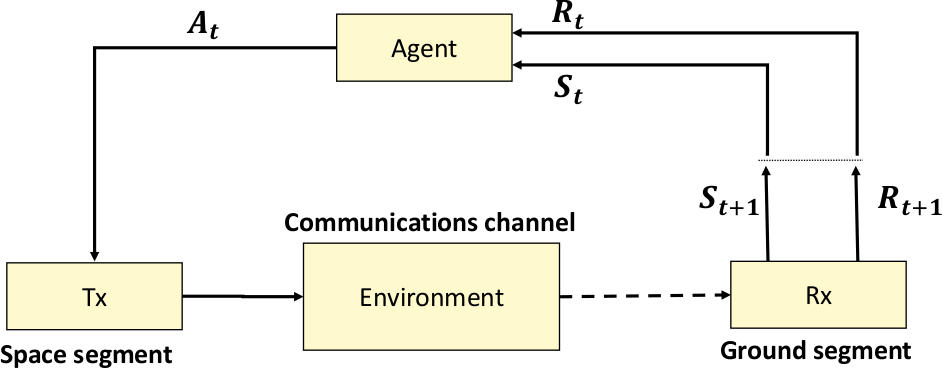

`2019-2-13 15:24:12`

# Multi-Objective Reinforcement Learning for  Cognitive Radio-Based Satellite Communications

## I - Introduction

目前已经针对CR的方法研究了机器学习（ML）技术，从而解决了一些软件无线电中的相关学习问题。最优化算法和机器学习方法均已经被研究去解决最佳化参数配置协助认知无线电系统，其大部分研究都集中于地面链路的频谱管理、传感技术等。卫星链路的情况是相同的，大部分研究都集中在频谱资源的分配上，而目前该领域并没有无线电资源分配的解决方案。

已经研究了两种方法，优化和ML，以确定它们如何在发现最佳配置参数集方面协助CR系统，大多数研究集中于地面链路的频谱管理，包括传感技术。 卫星链路的情况是相同的，大部分CR研究都集中在频谱资源分配上，据作者所知，在无线电资源管理方面几乎没有。

本文主要目的是分析认知引擎的框架，该框架可以使卫星通信的认知无线电系统能够学习过去的经验，推理并决策多个可用资源和多个目标。关于卫星通信信道，一些额外的因素在地面通信中并不产生影响，包括轨道动力学、航天器轨迹、速度和天线仰角、空间天气、此时的通信任务以及负载状态等。

这些因素放大了认知引擎执行决策过程的复杂性，因为多目标函数，无线电资源和端到端链路条件的维数比点对点地面链路更为复杂。不仅基于卫星的认知无线电资源管理复杂性增加，而且学习、推理和决策算法必须要重新设计，以便在动态变化和复杂的环境中操作时适应这些新的挑战。

后面省去一堆废话，讲该项目的意义。

本文介绍了`Ka`波段(`26GHz`)基于卫星认知无线电的强化学习技术的性能分析。首先是第二节中对强化学习进行了概述，第三部分给出框架设计和数值评估，第四节介绍系统环境，第五部分给出仿真结果和性能分析，第六部分概述了应用，第七部分做了简单总结。

## II - Reinforcement Learning Overview

在一本强化学习专著中，最开始就是介绍**多臂赌博机**(`multi-armed bandit (MAB) `)问题。这个问题实际上就是对最佳选项组合获取最佳奖励问题的建模。该问题中，假设`K`个独立的摇臂产生相互独立的`reward`，其奖励服从某种概率分布。这时一个`policy`选择不同的摇臂，该过程即`action`，在执行后会给出相应的`reward`。一些出版物已经将`MAB`问题应用于`CR`问题。

上述的`MAB`问题实际上也可以建模为一个状态转换问题。因此在特定环境`environment`下，所选择的操作可能最终导致系统`state`发生改变。因此状态转换本身可以被建模为马尔科夫决策过程`Markov Decision Process`。状态转换可以是确定性的，即在给定状态下采取指定动作总是使系统处于相同状态或随机状态（下一个状态是相同的随机变量）。在本文中仅考虑确定性案例。马尔科夫决策过程根据期末性进行分类，如果存在状态转移模型，则认为所采用的算法为`DP, Dynamic Programming`；如果`MDP`是无模型的，则称为强化学习`Reinforcement Learning`方法。强化学习中，算法在没有模型的情况下启动，并且在线构建一个或根本不采用模型时，我们称其为`Q-Learning`算法。

强化学习是用于解决多臂赌博机的技术之一，目的是学习和优化，同时在未知环境中进行操作。当系统模型过于复杂的时候，强化学习是一个较好的选择。该技术目的在于提供一个`agent`来学习环境，使用`noisy`的观察来建立真实世界的最佳模型。构建模型后，系统会尝试根据此时可用的操作来逼近最佳操作。在采用特定的`policy`选择`action`之后，系统采用该`action`与`environment`进行交互，结果将是产生一个新的`state`和一个`reward`。`reward`描述的是我们采取的`action`与使系统与目标的接近程度。

简单插入一张图片来表达上述意思。`agent`感知环境的状态`state`与上一个`action`的得分，并依据此结果进行新的`action`的选择，并继续观测结果调整模型。

`agent`在特定`policy`下产生，该`policy`即尝试优化系统的`reward`。在这个过程中往往有`exploration`和`exploitation`两个过程。

- `exploration:`系统进行随机尝试新`action`
- `exploitation:`系统在考虑当前`state`的条件下，尝试曾经使用过的获得最佳`reward`的`action`

这种方法的吸引力在于，无论系统是在哪种模式下，系统总是会强化其对于某个确定`state`的学习。

强化学习记录其性能的方式是通过计算`Q-learning`算法的`Q-function`
$$
\begin{equation*}
\begin{split}
Q_{k+1}(s_k,u_k)=Q_k(s_k,u_k)+\alpha_k\left[r_{k+1}+\gamma Q_k(s_{k+1},u_{k+1})-Q_k(s_k,u_k) \right]

\end{split}
\tag{1}
\end{equation*}
$$
> 可以看出这里，更新后的Q值与状态更新前的值和新状态下的估值有关，并采用两个权重控制各自的比例。

本结果通过`Bellman equations`进行推导。该函数计算了更新后的`Q-val`$$Q_{k+1}$$。其中`s`和`u`分别代表的是状态`state`和动作`action`。这里还有一个代表时间的标志`k`。$$u_{u'}$$代表无`action`。$$\alpha_k\in [0,1]$$，即学习率；$$\gamma_k$$是折扣因子。当$$s_k\to s_{k+1}$$时，`reward`为$$r_{k+1}$$。

$$\gamma$$是更新`Q-val`时的比例权重；$$\alpha$$和$$\gamma$$的选取要在解决方案的质量和收敛速度之间权衡，属于设计者调整的参数；本文中采用经典的方法，即$$\alpha$$在每次迭代时减小。

在无线电参数决策环境中，上述等式的时间差部分被认为是`granted`去除掉。基于一种较为知名的理念，即为了让之前学习到的知识充分帮助后面进行决策，因此选择折扣因子$$\gamma​$$为某一特定值抵消后面的差值部分。此时修改上述函数为
$$
\begin{equation*}
\begin{split}
Q_{k+1}(s_k,u_k)=Q_k(s_k,u_k)+\alpha_kr_{k+1}

\end{split}
\tag{2}
\end{equation*}
$$

> 这里去掉了$$\gamma$$权重，实际上是消除了前后两个状态之间的差值，让Q值自然累计。

虽然环境模型不是必要的，但是也需要定义一些函数，例如`state-action`的`policy`$$h$$
$$
\begin{equation*}
\begin{split}
u_k=h(s_k)

\end{split}
\tag{3}
\end{equation*}
$$

> 状态到行动的映射函数。

负责`exploration`与`exploitation`之间的权衡，状态转移`state transition`函数
$$
\begin{equation*}
\begin{split}
s_{k+1}=g(s_k,u_k)

\end{split}
\tag{4}
\end{equation*}
$$

> 根据当前状态与行动，状态会发生改变。

还有一个`reward function`$$\rho$$
$$
\begin{equation*}
\begin{split}
r_{k+1}=\rho(s_k,u_k)

\end{split}
\tag{5}
\end{equation*}
$$

> 显然`reward`是根据当前状态下的行动值来计算的。`env`很快就会计算出新的`state`，并由`agent`决策新的`action`，二者继续计算新的`reward`

这里需要提到的是，对于无模型的强化学习算法中，$$g$$是不需要的，因为新的状态$$s_{k+1}$$可以直接观测到。

但是实现强化学习还存在很多挑战。例如上述一些参数的选择、$$(3)-(5)$$的定义等。而关于`policy`函数，有三个算法可以定义`policy`。

- `value iteration`。搜索最大`Q-val`并用于计算最优`policy`
- `policy iteration `。迭代一组`policy`并评估其结果，构建新的集合以便在下一次迭代中进行评估。
- `policy search `。计算量很大，包括使用优化技术直接搜索最优`policy`

`policy function`就是用`state`确定`action`的函数。

关于`policy iteration `，`policy`评估可以离线执行（仅在`Q-function`收敛后执行），也可以在线执行，该算法被称为`SARSA`，使用$$Q_k(s_{k+1},u_{k+1})$$代替$$max_{u'}Q_k(S_{k+1,u_{u'}})$$。

接下来的工作均采用 确定性强化学习`Q-Learning`在线决策，即`SARSA`，并注意到没有时序差分项和折扣因子。

